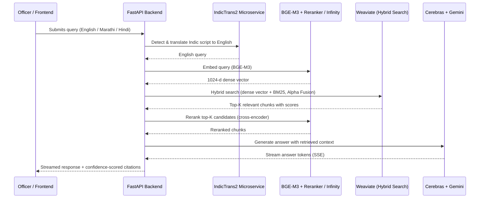
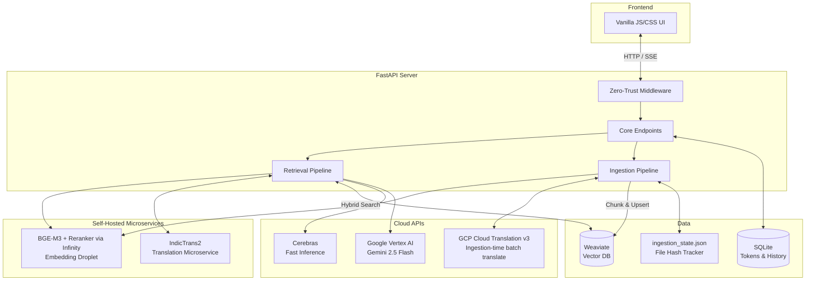

<div align="center">
  
</div>

# Mimir Engine

Mimir is an **Extensible AI-powered Retrieval-Augmented Generation (RAG) Engine** designed as the foundational backend for deploying secure, citation-backed conversational interfaces across government intranets.

Built for flexibility, Mimir separates the core AI retrieval logic from the frontend presentation layer. While the repository includes a reference implementation (an Officer Portal for the Higher & Technical Education Department, Government of Maharashtra), the engine itself is completely department-agnostic. By simply swapping the frontend stylesheet and connecting a different Weaviate collection, Mimir can instantly power dedicated portals for Finance, Health, Police, or Revenue — requiring zero backend code changes.

Named after the Norse figure who guarded the Well of Wisdom, Mimir represents the institutional memory and secure intelligence infrastructure of the modern digital government.

---

## Key Features & Capabilities

- **Lightweight, High-Performance Architecture**:
  - Entirely powered by **FastAPI** for lightning-fast backend endpoints.
  - A zero-dependency Vanilla JS/CSS frontend with native **Dark Mode**, mobile-responsive layouts, and real-time streaming via **Server-Sent Events (SSE)**.

- **Semi-Agentic RAG Pipeline**:
  - **Hybrid Search**: Combines dense vector search with BM25 keyword search, merged natively in **Weaviate** using Alpha Fusion. Alpha weight is dynamically tuned — GR-number pattern queries go BM25-heavy; general queries use balanced fusion.
  - **Self-Hosted Embeddings**: Uses **BGE-M3** (BAAI) served via **Infinity** on a dedicated droplet — eliminating cloud embedding quota constraints and reducing per-query embedding cost to zero.
  - **Self-Hosted Cross-Encoder Reranking**: Fast mode (the default query path) reranks hybrid search candidates with a **BGE reranker** cross-encoder, also served via **Infinity** on the embedding droplet — no LLM call, no added token cost, sub-second-to-low-single-digit-second rerank latency.
  - **Ultra-Low Latency Inference**: Routes agentic reasoning and tool-use through **Cerebras** for sub-2s response times, reserving **Google Gemini 2.5 Flash** (via Vertex AI) for complex generation and fallback translation.

- **Multilingual Support**:
  - Queries in **Marathi** and **Hindi** (Devanagari script) are automatically detected and translated to English via a self-hosted **IndicTrans2** microservice before retrieval.
  - Ingested Marathi/Hindi chunks are batch-translated using **GCP Cloud Translation v3** and stored alongside the original, enabling bilingual retrieval.

- **Idempotent Document Ingestion Pipeline**:
  - File-hash-based state tracking (`scratch/ingestion_state.json`) ensures re-ingestion runs are safe and never duplicate data.
  - Handles standard PDFs and pre-translated `.en.txt` plaintext GRs from the Orgpedia corpus. PDF text extraction uses a 3-tier fallback chain — **PyMuPDF4LLM** (fast, local) → **Google Document AI OCR** → **Gemini Vision** — so scanned/image-only circulars that defeat the primary parser still get ingested.
  - Semantic, boundary-aware chunking preserves tabular context — table rows isolated without their column headers are enriched with the nearest preceding header rows before embedding.
  - Parent-child chunk hierarchy: parent sections provide retrieval context; child chunks are the actual embedded units.

- **Enterprise-Grade Security & Authentication**:
  - **Zero-Trust Intranet Geofencing**: Middleware validates incoming requests against authorized government subnets (e.g., `10.0.0.0/8`). Public traffic is dropped at the perimeter.
  - **Token-Based Identity**: A built-in SQLite token registry replaces passwords. Chat histories are securely mapped to hashed officer tokens.
  - **Admin CRUD API**: Fully baked API for IT departments to provision, audit, and revoke officer tokens programmatically.

- **Cross-Device Persistent Sessions**:
  - Chat histories persist in SQLite rather than browser storage. Officers can switch between desktop and mobile without losing conversation context.

---

## Architecture

### System Flow



### Component Architecture



### Directory Tree

```text
mimir/
├── main.py                             # CLI entry point (Ingestion, Retrieval, Benchmark)
├── app.py                              # FastAPI server, Zero-Trust gateway, SSE endpoints
├── db.py                               # SQLite token registry & chat history manager
├── requirements.txt                    # Python dependencies
│
├── templates/                          # Frontend UI (Vanilla HTML/JS/CSS)
│   ├── landing.html                    # Public-facing landing page
│   ├── login.html                      # Officer login gateway
│   ├── portal.html                     # Authenticated officer chat interface
│   └── app.html                        # Base chat interface
│
├── core/                               # Shared core infrastructure
│   ├── utils.py                        # API clients, retry/throttle decorators, embed routing
│   └── log_config.py                   # Centralized structured logging
│
├── ingestion/                          # Ingestion pipeline
│   ├── pipeline.py                     # PDF ingestion orchestrator (hash-skip, upsert)
│   ├── orgpedia_pipeline.py            # Orgpedia .en.txt GR ingestion orchestrator
│   ├── chunking.py                     # Semantic parent-child chunking, translation & embedding
│   ├── parsers.py                      # PyMuPDF4LLM → Markdown parser
│   ├── metadata.py                     # LLM-based GR metadata extraction
│   └── state.py                        # File hash tracking & ingestion state
│
├── retrieval/                          # Retrieval & generation pipeline
│   ├── pipeline.py                     # Agentic loop orchestrator & SSE streaming
│   ├── search.py                       # Hybrid search, alpha tuning, reranking, evidence
│   └── query.py                        # Query contextualization & multi-query expansion
│
├── benchmark/                          # Corpus evaluation & benchmark harness
│   ├── benchmark.json                  # Ground-truth evaluation dataset (multi-category)
│   └── runner.py                       # Benchmark execution & LLM-judge scoring
│
├── scratch/                            # Dev scripts & persisted state
│   ├── ingestion_state.json            # File hash & incremental ingestion state tracker
│   ├── generate_benchmark_full.py      # Document-level LLM benchmark generator (full corpus)
│   └── mimir_cache.json                # Persistent query cache
│
├── data/                               # Weaviate deployment
│   └── docker-compose.yml              # Weaviate standalone compose file
│
└── docs/                               # Source documents for ingestion
    ├── *.pdf                           # Standard government PDF circulars & acts
    └── orgpedia_mahGRs/
        └── *.pdf.en.txt                # Pre-translated Orgpedia Maharashtra GR plaintext files
```

---

## Installation & Setup

### Prerequisites

| Dependency | Purpose |
|---|---|
| Python 3.10+ | Core runtime |
| Google Cloud Project (Vertex AI) | Gemini 2.5 Flash generation + GCP Translation |
| Cerebras API Key | Fast agentic inference |
| Weaviate instance | Vector store (local via Docker or remote droplet) |
| BGE-M3 / Infinity server | Self-hosted embedding microservice |
| IndicTrans2 microservice | Marathi/Hindi → English query translation |

### 1. Clone & Install

```bash
git clone https://github.com/pushkqr/mimir.git
cd mimir
python -m venv .venv
# Windows:
.venv\Scripts\activate
# Linux/macOS:
source .venv/bin/activate
pip install -r requirements.txt
```

### 2. Deploy Weaviate

Weaviate runs as a standalone service. Use the provided compose file:

```bash
cd data
docker-compose up -d
cd ..
```

Or point `WEAVIATE_URL` to an existing remote instance.

### 3. Configure Environment

Copy `.env.example` to `.env` and fill in your values:

```env
# Google Cloud (Vertex AI)
GOOGLE_CLOUD_PROJECT=your-gcp-project-id
GOOGLE_CLOUD_LOCATION=asia-south1
USE_VERTEX_AI=True

# Inference
CEREBRAS_API_KEY=your_cerebras_api_key
GEN_MODEL_NAME=gemini-2.5-flash

# Self-hosted Embedding Microservice (BGE-M3 via Infinity)
LOCAL_EMBED_URL=http://<YOUR_EMBED_DROPLET_IP>:7997/embeddings
LOCAL_EMBED_API_KEY=your_embed_api_key          # if secured
USE_AISTUDIO_FOR_EMBEDDINGS=False

# Self-hosted Cross-Encoder Reranking (BGE reranker, same Infinity server)
LOCAL_RERANK_URL=http://<YOUR_EMBED_DROPLET_IP>:7997/rerank
LOCAL_RERANK_API_KEY=your_rerank_api_key        # if secured
LOCAL_RERANK_MODEL_NAME=BAAI/bge-reranker-base  # must match whatever model Infinity actually loaded

# Fast-mode retrieval tuning (candidate pool size vs. rerank pool size)
FAST_MODE_CANDIDATE_LIMIT=20
FAST_MODE_RERANK_LIMIT=12

# Translation Microservice (IndicTrans2)
TRANSLATION_SERVICE_URL=http://<YOUR_TRANS_DROPLET_IP>:8000/translate

# Weaviate
WEAVIATE_URL=http://<YOUR_WEAVIATE_IP>
WEAVIATE_GRPC_PORT=50051
WEAVIATE_API_KEY=your_weaviate_api_key

# Security
MIMIR_AUTH_TOKEN=your_secure_officer_password
MIMIR_ADMIN_TOKEN=your_secure_admin_token
# Comma-separated CIDRs. Use 0.0.0.0/0 to allow all (demo mode).
MIMIR_ALLOWED_SUBNETS=10.0.0.0/8
```

---

## Usage

### Start the Web Application

```bash
python app.py
# or
uvicorn app:app --reload
```

Navigate to `http://localhost:8000` for the landing page, `http://localhost:8000/portal` for the officer chat interface, or `http://localhost:8000/admin` for the admin console.

### Ingest Documents

Place PDFs in `docs/` and Orgpedia plaintext GRs in `docs/orgpedia_mahGRs/`. Then set flags in `main.py`:

```python
RUN_INGESTION = True     # Ingest/re-index PDFs
RUN_RETRIEVAL = False    # Interactive CLI chat
RUN_BENCHMARK = False    # Run benchmark evaluation
```

```bash
python main.py
```

Ingestion is **idempotent** — re-running with unchanged files is a no-op (files are skipped based on SHA-256 hash). To force re-ingestion, pass `force_reingest=True` or delete `scratch/ingestion_state.json`.

### Run Benchmark

```bash
# Set RUN_BENCHMARK = True in main.py, then:
python main.py

# Or run standalone:
python benchmark/runner.py
```

### Generate a Full Corpus Benchmark Dataset

For generating new benchmark questions from the full corpus (document-level LLM generation, not chunk-level):

```bash
python scratch/generate_benchmark_full.py \
  --out benchmark/benchmark_100.json \
  --max-doc-chars 15000 \
  --resume
```

Large documents (> `--max-doc-chars` characters) are skipped automatically. Use `--resume` to continue interrupted runs incrementally.

---

## Self-Hosted Microservices

Mimir decouples compute-heavy tasks into independent microservices to avoid cloud quota constraints and reduce per-query cost.

### BGE-M3 Embedding (Infinity)

Deploy on any GPU or CPU droplet:

```bash
pip install infinity-emb[all]
infinity_emb v2 --model-id BAAI/bge-m3 --port 7997
```

Set `LOCAL_EMBED_URL=http://<host>:7997/embeddings` in `.env`. The system automatically routes all embedding calls (ingestion + retrieval) through this endpoint.

### BGE Reranker (Cross-Encoder)

The same Infinity server can also serve a reranking model — no separate deployment needed:

```bash
infinity_emb v2 --model-id BAAI/bge-reranker-base --port 7997
```

Set `LOCAL_RERANK_URL=http://<host>:7997/rerank` in `.env`. Fast-mode retrieval sends the hybrid search candidates here for cross-encoder reranking before generation. `LOCAL_RERANK_MODEL_NAME` must match whatever model the server actually has loaded — Infinity returns an HTTP 400 if it doesn't, so verify against the server's `/models` endpoint after deploying.

### IndicTrans2 Translation

Deploy the IndicTrans2 FastAPI microservice. On query, the system detects Devanagari script and translates to English before embedding:

```
POST /translate
{"text": "...", "src_lang": "mar_Deva", "tgt_lang": "eng_Latn"}
```

Set `TRANSLATION_SERVICE_URL=http://<host>:8000/translate` in `.env`.

---

## Disclaimer

Mimir is designed for administrative decision support. While it prioritizes strict retrieval-based grounding with source citations, always verify outputs against official published government circulars and gazette notifications before taking administrative action.
