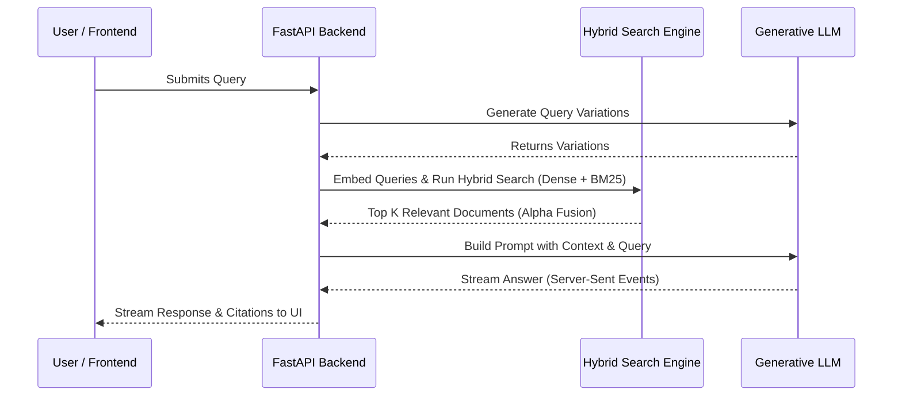
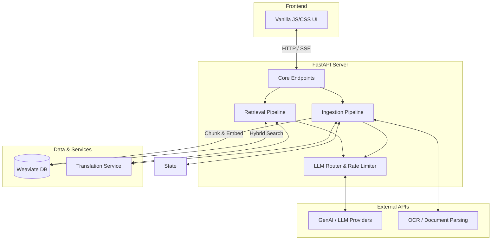

<div align="center">
  
</div>

# Mimir

Mimir is an AI-powered Retrieval-Augmented Generation (RAG) system and interactive chat surface designed specifically for querying, comparing, and analyzing government policy documents, circulars, and notifications.

Built for citation-backed grounding and high-precision retrieval, responses are synthesized strictly from indexed local documents, eliminating hallucinated policy text. Named after the Norse figure who guarded the Well of Wisdom, Mimir represents memory and institutional knowledge you can rely on.

---

## Key Features & Capabilities

- **Lightweight, High-Performance Architecture**: 
  - Entirely powered by **FastAPI** for lightning-fast backend endpoints.
  - A beautiful, zero-dependency vanilla JS/CSS frontend with native **Dark Mode** and mobile-responsive layouts.
  - Streamed Server-Sent Events (SSE) for real-time answer generation.

- **Agentic RAG Pipeline**:
  - Uses Google Gemini for query understanding, dense embeddings (`gemini-embedding-001`), and generative answering.
  - **Hybrid Search Engine**: Combines **Dense Vector Search** with **BM25 Sparse Keyword Search**, merged natively in **Weaviate** using Alpha Fusion for unparalleled retrieval accuracy.

- **Robust Authentication & Security**:
  - Built-in token-based authentication middleware. Set `MIMIR_AUTH_TOKEN` in your environment to protect the backend endpoints.
  - The public landing page remains accessible, while the `/app` surface and `/ask` endpoints are locked securely behind the gate.


- **Contextual Conversation Memory**:
  - Persistent threads saved locally on the client using `localStorage`.
  - Workspace segregation allows you to sandbox different policy domains (e.g., HR policies vs. IT policies).

---

## Architecture

### System Flow
The following sequence demonstrates how a user's query is processed from ingestion through to the streamed response:



### Component Architecture
This diagram outlines the core services and their interactions:



### Directory Tree

```text
rag/
├── main.py                             # CLI entry point (Ingestion, Retrieval, Benchmark)
├── app.py                              # FastAPI server and core endpoints (/ask, /workspaces)
├── requirements.txt                    # Python dependencies
│
├── templates/                          # Frontend UI (Vanilla HTML/JS/CSS)
│   ├── landing.html                    # Public-facing landing page
│   └── app.html                        # Authenticated chat interface
│
├── scratch/                            # Temporary & Persisted State
│   ├── ingestion_state.json            # File hashing & incremental ingestion state tracker
│   └── mimir_cache.json                # Persistent JSON query cache
│
├── core/                               # Shared Core Infrastructure
│   └── utils.py                        # API rate-limit retry, throttle, & LLM routing
│
├── ingestion/                          # Ingestion Pipeline
│   ├── pipeline.py                     # Ingestion orchestrator & hash skip logic
│   └── parsers.py                      # PyMuPDF4LLM -> Markdown parser sequence
│
├── retrieval/                          # Retrieval & Generation Pipeline
│   ├── pipeline.py                     # Hybrid search & streaming response orchestrator
│   ├── search.py                       # Alpha fusion, LLM reranking, & evidence extraction
│   └── query.py                        # Contextualization & multi-query expansion
│
└── benchmark/                          # Corpus Evaluation & Benchmark Harness
    ├── benchmark.json                  # Standardized 30-case grounded evaluation dataset
    └── runner.py                       # Benchmark execution & LLM judge runner
```

---

## Installation & Setup

### 1. Prerequisites

- Python 3.10+
- Google Gemini API Key
- Cerebras API Key (for LLM Generation)
- [Weaviate](https://weaviate.io/) (Can run locally or remotely)
- Translation Service (Can run locally or remotely)

### 2. Installation

1. **Clone the repository**:

   ```bash
   git clone https://github.com/pushkqr/mimir.git
   cd mimir
   ```

2. **Create and activate a virtual environment**:

   ```bash
   python -m venv .venv
   # Windows:
   .venv\Scripts\activate
   # Linux/macOS:
   source .venv/bin/activate
   ```

3. **Deploy Weaviate (Local or Remote)**:
   You can run Weaviate locally using the provided `docker-compose.yml` or deploy it to a remote server using `data/docker-compose.yml`. For local deployment:
   ```bash
   docker-compose up -d
   ```

4. **Install dependencies**:

   ```bash
   pip install -r requirements.txt
   ```

5. **Configure environment variables**:
   Create a `.env` file in the root directory. You can copy the provided `.env.example`:

   ```env
   # Required: API keys
   GOOGLE_API_KEY=your_gemini_api_key
   CEREBRAS_API_KEY=your_cerebras_api_key
   
   # Remote / External Services (Optional depending on architecture)
   # Point these to your hosted microservices if deploying in a distributed environment
   TRANSLATION_SERVICE_URL=http://<YOUR_TRANSLATION_IP>:8000/translate
   WEAVIATE_URL=http://<YOUR_WEAVIATE_IP>
   WEAVIATE_GRPC_PORT=50051
   WEAVIATE_API_KEY=your-secure-weaviate-api-key

   # Model Configuration
   GEN_MODEL_NAME=gemini-2.5-flash
   EMBED_MODEL_NAME=gemini-embedding-001

   # Security
   # Set this to protect your app. Leave empty for public access.
   MIMIR_AUTH_TOKEN=your_secure_password
   ```

---

## Usage

### Launching the Web Application

Start the FastAPI server via Uvicorn:

```bash
python app.py
# or
uvicorn app:app --reload
```
Navigate to `http://localhost:8000/` to view the landing page, or `http://localhost:8000/app` to access the chat interface.

### Ingestion & CLI Pipeline (`main.py`)

To ingest documents, test interactive CLI retrieval, or run corpus benchmarks, configure the execution flags in `main.py`:

```python
RUN_INGESTION = True    # Re-index PDFs in docs/
RUN_RETRIEVAL = False   # Run interactive CLI chat
RUN_BENCHMARK = False   # Run corpus benchmark evaluation
```

Then execute:

```bash
python main.py
```

---

## Disclaimer

Mimir is designed for administrative decision support. While it prioritizes strict retrieval-based grounding, always verify outputs against official published government circulars and gazette notifications.
