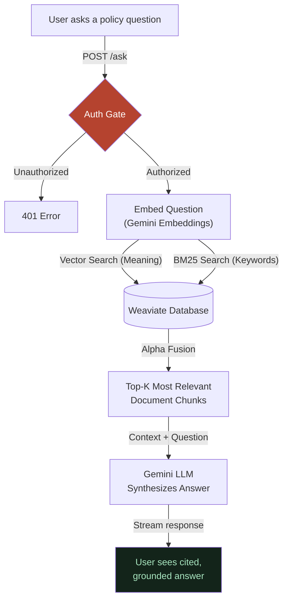

# 00 — Overview: The Whole Pipeline in One Map

**In one line:** Users ask a policy question, the system checks if you have access, checks if it already knows the answer to save time, and if not, digs through a hybrid index to pull the exact source documents before letting an LLM write a verified, cited answer.

---

## ELI10 — the analogy

Imagine a massive, heavily guarded **Library of Official Rules**.

1. **The Security Guard:** When you walk up, a guard checks your badge (`MIMIR_AUTH_TOKEN`). If you don't have one, you don't get in.
2. **The Card Catalog:** If it's a new question, the Librarian uses a magical dual-index system (the **Hybrid Search**). One index searches for exact words, the other searches for *meaning*. They combine the results using Alpha Fusion to find the exact 5 pages in the library that contain the answer.
3. **The Final Report:** The Librarian reads those 5 pages, writes a clean, easy-to-understand answer, and hands it to you, specifically highlighting exactly which book and page they got the information from so you can verify it yourself.

That is the entire architecture of Mimir.

---

## The real pipeline (this project)

Here is the end-to-end flow. The coral node is the **Security Gate**; the teal node is the grounded answer the LLM writes.

---

## The five stages, in plain words

1. **The Auth Middleware.** Mimir is built on FastAPI. The very first thing that happens on any request (except the public landing page) is our lightweight ASGI middleware checking the `Authorization` header for your `MIMIR_AUTH_TOKEN`. If it doesn't match, the request dies right there. See [03-security-and-auth.md](03-security-and-auth.md).

2. **Hybrid Search (Dense + Sparse).** We don't just rely on vector embeddings (which are great at meaning, but bad at finding exact ID numbers like "Form 1040"). We run a BM25 Keyword search and a Dense Vector search at the same time, and merge them using Alpha Fusion inside Weaviate. See [01-hybrid-retrieval.md](01-hybrid-retrieval.md).

3. **Generation.** We inject those top chunks into the `TRIAGE_PROMPT`, strictly instructing the model to *only* use the provided context, preventing hallucinations.

4. **Benchmark Integrity.** How do we know this actually works? We run an automated harness across 30 hard policy questions, grading the system on a strict rubric. See [04-benchmark-and-evaluation.md](04-benchmark-and-evaluation.md).

---

## Why it matters

- **It's lightning fast.** By ripping out heavy web frameworks and using vanilla JS + FastAPI, the UI renders instantly and the backend is completely asynchronous.
- **It's honest.** We don't claim zero hallucinations through magic. We achieve it through strict deterministic prompting, hybrid retrieval, and a ruthless benchmarking suite that proves the system's accuracy letter by letter.
